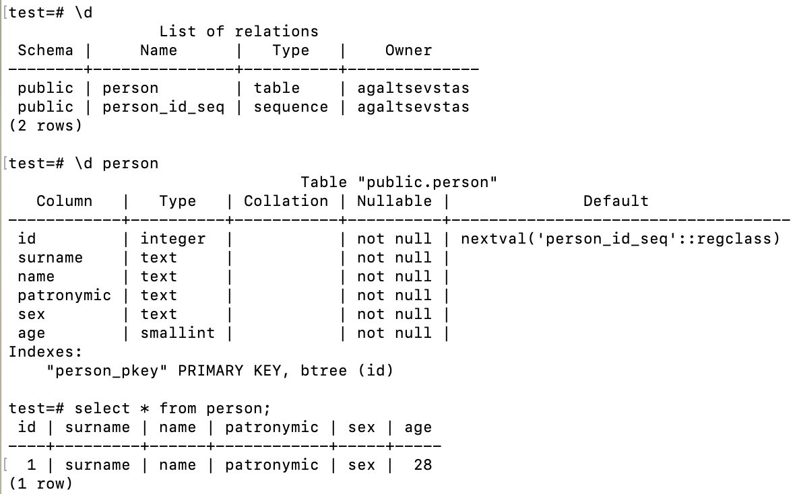

# Postgres
Знакомство с базой данной PostgreSQL с использованием бибилотек pq++/pqxx.
Структура:
<p align="center">

</p>


## Поддерживаемые платформы
* macOS
  * Среда разработки Xcode

## Требования:
* Библиотека pqxx (postgres):
[libpqxx](https://github.com/jtv/libpqxx?ysclid=lqh09ikoqh544846046)

## Установка библиотек pq++/pqxx
```
brew install libpq
brew install libpqxx
brew upgrade
brew upgrade
brew cleanup
```

### Загрузка
```
git clone https://gitlab.com/cplusplusprojects/Postgres.git
cd Postgres
```
